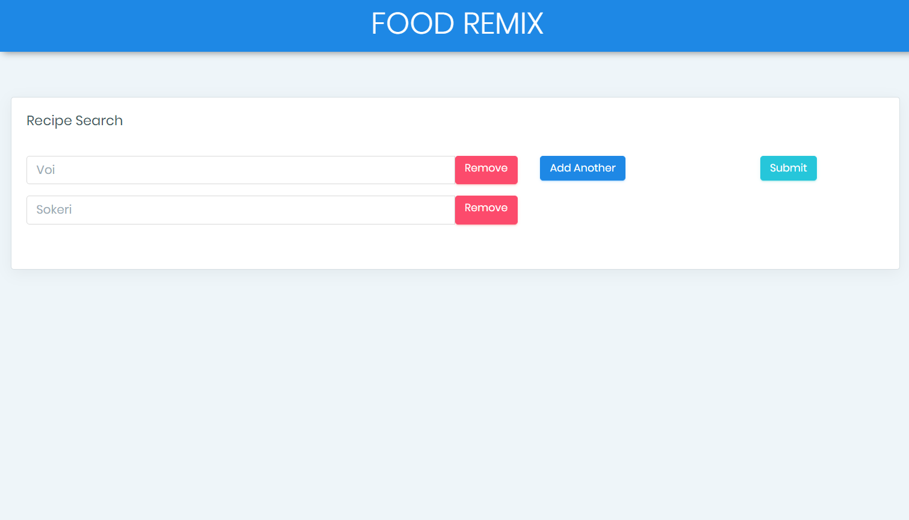
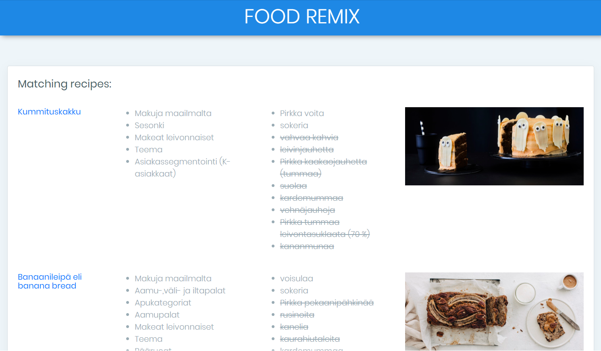

# Food Remix
Junction 2019 project in CGI-KGroup challenge: using data to help people reduce food waste and live healthier lives.

A recipe search engine based on ingredients, using the Kesko API and recipe database. Sorry, no fuzzy text matching or autocompletion, you must use precise ingredient names as in the database. For example, try "Voi" and "Sokeri".

<https://junction2019-cgi-kgroup.herokuapp.com>

